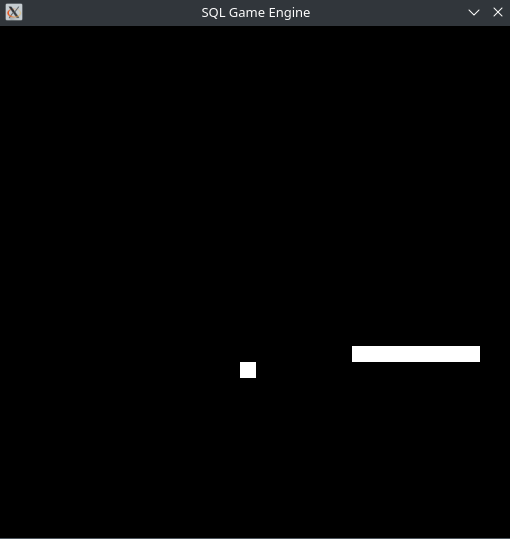

# SQL Game Engine
A game engine written in CPP with the game scripts written in SQL
The game screen is a simple 32 by 32 monochrome screen in a database table
The game data is saved to {GameName}.db, along with screendata

[](https://github.com/AkaneDev/SQLEngine/actions/workflows/cmake-multi-platform.yml)

## How to write your game
This engine is mono threaded due to me not wanting to deal with trying to load and run multiple sql 'scripts'
the game scripts are just plain .sql files

## Engine API / Tables

### Framebuffer
- **Table:** `framebuffer(x INT, y INT, pixel TINYINT)`
- **Purpose:** Stores the monochrome screen state.
- **Pixel values:** `0` = off, `1` = on.
- **Example usage in SQL:**
```sql
-- Clear the screen
UPDATE framebuffer SET pixel = 0;

-- Turn on a specific pixel
UPDATE framebuffer SET pixel = 1 WHERE x = 5 AND y = 10;
```

### Game State
- **Tables:** Game-specific, for example:
  - `snake_body(x INT, y INT, seq INT)` – stores snake segments.
  - `food(x INT, y INT)` – stores items/food.
  - `player_state(...)` – stores player-specific variables like position, health, score.
- **Rules:** Engine does not enforce logic; SQL scripts manage all state.

### Input Events
- **Table:** `input_events(event CHAR(1))`
- **Purpose:** Stores user input between frames.
- **Usage:** SQL scripts query this table to update game state, engine clears it after each frame.

### Tick / Frame Execution
- The engine executes your SQL script each frame to:
  1. Read `input_events`.
  2. Update game state tables.
  3. Update `framebuffer`.
- Engine fetches `framebuffer` for rendering and persists the `.db` file.

### Database Persistence
- Each game uses `{GameName}.db` to store all game data.
- Framebuffer, input, and game state are all saved here, allowing the game to resume from the last state.

### Examples
<details>
  <summary>Snake in SQL</summary>

  

</details>


